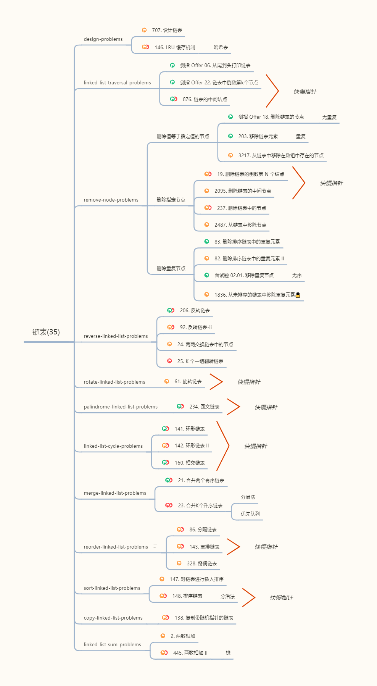

# 链表

[链表原理与基本操作](https://zhangguangze.github.io/blog/computer/algorithms/linked-list.html)

在学习了链表原理与基本操作之后，我们将学习链表的更多操作，如反转链表、旋转链表、合并链表、重排链表、排序链表、检查链表是否回文是否有环等；还将学习到删除列表节点的更多方式，以及如何使用双向链表实现 LRU 缓存。

