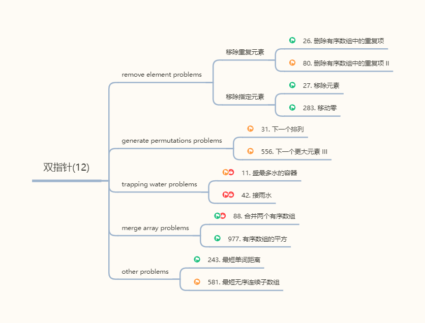

# 双指针

**双指针**（Two Pointers）是一种利用两个指针在数据结构中遍历的算法技巧。它是一种基于暴力解法的优化，可以将时间复杂度从 O(n²) 优化到 O(n)。

双指针主要包括以下两种类型：

- 同向双指针

  - 滑动窗口 两指针从左向右一起移动。常用于子数组/子串问题。

  - 快慢指针 两指针一快一慢向同一方向移动。常用于链表问题（如判断链表是否有环、寻找中间节点、删除链表节点）。

- 对撞双指针 两指针从两端向中间移动。常用于查找目标和、回文检查、二分查找和反转数据。

下面，我们将利用双指针来解决移除元素、生成排列、接雨水和合并数组等问题。

关于滑动窗口和快慢指针，我们将在后续的章节中详细介绍。
